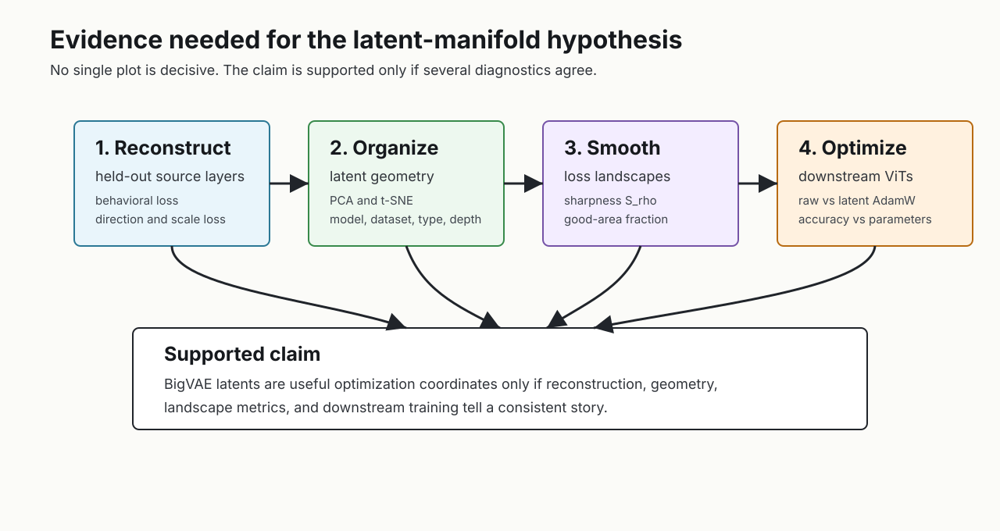
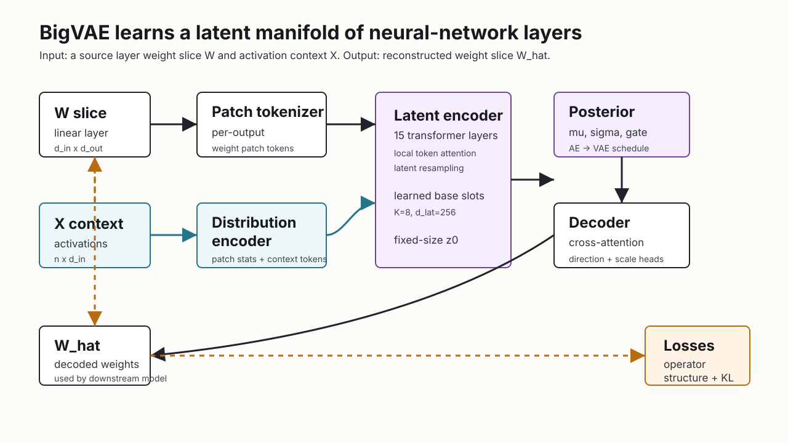
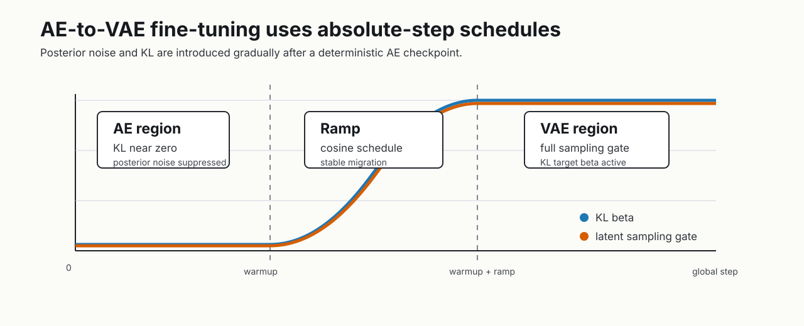
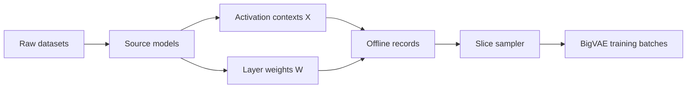

# BigVAE: A Latent Manifold for Neural Network Weights

**A technical preprint for the `diff-meta-opt` repository**

**Status.** Draft report. Heavy experiment figures are expected to be produced on
the remote training machine and inserted into the marked figure slots.

**Code.** `models/big_weight_vae.py`, `experiments/train_big_vae.py`,
`post_train_research/`

**Manuscript card.**

| Item | Summary |
|---|---|
| Object of study | Linear layers \(W\) from real pretrained models |
| Conditioning signal | Activation context \(X\) from examples seen by that layer |
| Learned representation | Fixed-size latent slot set \(z\) |
| Decoder output | Reconstructed weight slice \(\hat W\) |
| Primary training signal | Preserve both \(W\) structure and layer behavior \(XW\) |
| Main hypothesis | BigVAE latents are smoother optimization coordinates than raw weights |
| Main falsifier | Latent optimization fails or latent landscapes are not smoother than raw landscapes |

---

## Abstract

We study whether neural network weights can be optimized through a learned
latent manifold rather than directly in raw parameter space. The central object
is a variational autoencoder, **BigVAE**, trained on real linear layers extracted
from pretrained vision and multimodal models. Given a weight matrix and a small
activation context for the corresponding layer, BigVAE encodes the layer into a
fixed set of latent slots and decodes those slots back into a weight slice. The
training objective combines functional reconstruction of the layer operator,
patch-level structural reconstruction of weight direction and scale, and a KL
regularizer for the latent posterior.

The intended use is post-training optimization: replace direct optimization of
weights \(W\) with optimization of latent variables \(z\), where decoded weights
\(\hat W(z)\) are used by a downstream model. This report documents the model,
the training procedure, and the evaluation suite used to test the hypothesis
that BigVAE latents provide a smoother and more semantically organized search
space than raw weights.

---

## 1. Introduction

Modern neural networks are optimized in parameter spaces whose geometry is only
loosely related to function space. A small Euclidean perturbation of a weight
matrix can leave the function nearly unchanged, or it can catastrophically
change the layer output. Conversely, distinct raw parameter vectors can encode
nearly equivalent computations because of symmetries, rescalings, and redundant
representations.

This repository explores a simple but ambitious alternative: learn a generative
model of neural network layers, then optimize through its latent variables. If a
latent model captures the structure of real weights, then moving in latent space
may avoid many destructive raw-weight directions. In downstream optimization,
the effective parameterization becomes:

$$
z \mapsto \hat W_\theta(z, C),
$$

where \(C\) is a context derived from layer activations and metadata available at
the layer level. The downstream model still runs with ordinary weights, but
those weights are produced by a frozen decoder.

The project is organized around three empirical questions:

1. **Can BigVAE reconstruct held-out layers?**  
   This is tested with held-out model/dataset pairs and metrics decomposed by
   source model, dataset, layer type, and layer depth.

2. **Does the latent space organize neural weights meaningfully?**  
   This is tested by dumping latent vectors and visualizing PCA/t-SNE projections
   by model, dataset, layer type, and depth.

3. **Does latent optimization change the loss landscape?**  
   This is tested by comparing raw ViT weight-space landscapes against
   BigVAE-induced latent landscapes on MNIST, CIFAR-10, and a synthetic
   stripe-parity benchmark designed to make raw weight space rough.

### Contributions

This repository contributes a complete experimental system rather than a single
model file:

1. **A conditional VAE for neural layer weights.** BigVAE encodes real source
   model layers into fixed-size latent slots and decodes them back into
   shape-variable weight slices.
2. **A function-aware reconstruction objective.** The model is trained not only
   to reproduce weights, but also to preserve the layer operator \(XW\) on real
   activation contexts.
3. **An AE-to-VAE migration path.** Deterministic autoencoder checkpoints can be
   resumed as VAEs with gated posterior heads and absolute-step KL schedules.
4. **A held-out evaluation and geometry pipeline.** Reconstruction and latent
   organization are evaluated by source dataset, model, layer type, and depth.
5. **A downstream optimization testbed.** Tiny ViTs can be optimized either in
   raw weights or through frozen BigVAE latent slots, enabling direct comparison
   of optimization geometry.



**Figure 1.** The latent-manifold hypothesis is only persuasive if several
independent diagnostics align. Good reconstruction alone is not enough; the
latent space must also organize weights, induce smoother landscapes, and support
downstream optimization.

---

## 2. Problem Setup

Consider a source neural network layer represented as a linear map:

$$
f_W(X) = XW,
$$

where:

$$
X \in \mathbb{R}^{n \times d_{in}},
\qquad
W \in \mathbb{R}^{d_{in} \times d_{out}},
\qquad
XW \in \mathbb{R}^{n \times d_{out}}.
$$

Here \(X\) is an activation context collected from examples passing through the
source model, and \(W\) is a layer weight matrix. BigVAE is trained over records:

$$
r = (X, W, m, d, \ell),
$$

where \(m\) is the source model identity, \(d\) is the source dataset, and
\(\ell\) is the layer name. The layer name is later parsed into coarse layer type
and depth for analysis.

Because source layers have variable shapes, training operates on slices:

$$
S(r) = (X_s, W_s, M_s),
$$

where \(M_s\) denotes masks for valid input rows and output columns. The target
slice has shape:

$$
W_s \in \mathbb{R}^{B \times d_{in}^{s} \times d_{out}^{s}},
\qquad
X_s \in \mathbb{R}^{B \times n^{s} \times d_{in}^{s}}.
$$

The BigVAE objective is to learn an encoder-decoder pair:

$$
q_\phi(z \mid W_s, X_s),
\qquad
p_\theta(W_s \mid z, X_s),
$$

such that the decoded matrix \(\hat W_s\) preserves both the raw structure of the
weight slice and the behavior of the layer on the activation context.

---

## 3. Architecture

BigVAE is a conditional VAE over weight matrices. The conditioning signal is not
a class label or text prompt; it is a distributional summary of the layer input
activations.



**Figure 2.** BigVAE receives a weight slice \(W_s\) and activation context
\(X_s\). The weight slice is patch-tokenized, the context is summarized by a
distribution encoder, and latent slots are decoded back into a reconstructed
weight slice \(\hat W_s\). Losses compare both the reconstructed matrix and the
layer operator on \(X_s\).

### 3.1 Weight Patching

Let \(p\) be `patch_size`. The input dimension is padded and partitioned into
patches:

$$
T = \left\lceil \frac{d_{in}^{s}}{p} \right\rceil.
$$

The padded weight slice is reshaped as:

$$
W_s
\rightarrow
W_{patch}
\in
\mathbb{R}^{B \times d_{out}^{s} \times T \times p}.
$$

Thus every output channel owns a sequence of input-patch vectors. This preserves
the natural row/column structure of a linear layer while allowing the model to
handle variable \(d_{in}\) and \(d_{out}\).

### 3.2 Distribution Encoder

The activation context \(X_s\) is summarized into per-patch statistics and
tokens. In the current configuration, these features condition the model through
two routes:

1. **Patch tokenizer conditioning.** The tokenizer receives both the weight patch
   and activation-distribution features.
2. **Encoder token adapters.** Each encoder layer can apply a gated residual
   conditioning adapter to patch tokens.

This conditioning is important because the same raw matrix perturbation can have
very different functional impact depending on the input distribution.

### 3.3 Encoder

BigVAE uses a learned latent base:

$$
L_0 \in \mathbb{R}^{K \times d_z},
$$

where \(K\) is `big_vae.num_latents` and \(d_z\) is `big_vae.d_lat`.

For each output column, the encoder builds a token sequence:

$$
[\mathrm{CLS}_o,\ w_{o,1}, \ldots,\ w_{o,T}].
$$

A stack of latent encoder layers alternates between local token processing and
latent resampling. The result is a fixed-size latent representation:

$$
L = E_\phi(W_s, X_s)
\in
\mathbb{R}^{B \times K \times d_z}.
$$

The flattened latent is normalized:

$$
z_0 = \mathrm{LayerNorm}(\mathrm{vec}(L)).
$$

### 3.4 Posterior and Sampling Gate

If latent sampling is disabled, BigVAE is a deterministic autoencoder:

$$
z = z_0,
\qquad
\mu = z_0,
\qquad
\log \sigma^2 = 0.
$$

If latent sampling is enabled, the model uses posterior heads:

$$
\mu =
(1-g) z_0
+
g\,\mu_\phi(z_0),
$$

$$
\tilde\sigma =
\exp\left(\frac{1}{2}\log\sigma^2_\phi(z_0)\right),
$$

$$
\sigma =
\max(\sigma_{\min},\ g\,\tilde\sigma).
$$

The latent sample during training is:

$$
z = \mu + \epsilon\sigma,
\qquad
\epsilon \sim \mathcal{N}(0,I).
$$

At evaluation time, the model uses \(z=\mu\).

The gate \(g\) is an absolute-step schedule. It is used to make deterministic
AE-to-VAE fine-tuning stable: the VAE heads are introduced with nearly zero
sampling noise, then gradually take over.

### 3.5 Decoder

The decoder maps latent slots back to a weight slice. It builds query tokens for
each output-column/input-patch coordinate and cross-attends to latent slots.
The output head predicts patch direction and scale:

$$
\hat u_{o,t} = h_{dir}(q_{o,t}),
\qquad
\hat s_{o,t} = h_{scale}(q_{o,t}),
$$

which are combined into reconstructed patch weights:

$$
\hat w_{o,t} =
\exp(\hat s_{o,t})
\frac{\hat u_{o,t}}{\lVert \hat u_{o,t}\rVert_2 + \epsilon}.
$$

This parameterization makes direction and magnitude explicit, matching the
structural loss decomposition.

### 3.6 Current Model Configuration

The current stage-1 model configuration is:

| Parameter | Value |
|---|---:|
| `patch_size` | 64 |
| `big_vae.d_model` | 512 |
| `big_vae.d_lat` | 256 |
| `big_vae.num_latents` | 8 |
| `big_vae.num_encoder_layers` | 15 |
| `big_vae.num_decoder_layers` | 6 |
| `big_vae.n_heads` | 8 |
| `big_vae.ffn_mult` | 4.0 |
| `patch_tokenizer_kind` | `conditioned_mlp` |
| `distribution_encoder_conditioning_kind` | `token_adapter` |
| `disable_z_shortcut` | true |

### 3.7 Design Principles

The architecture is built around four design constraints.

| Constraint | Architectural response |
|---|---|
| Source layers have different shapes | Slice layers into patch/output-column blocks and use masks |
| Raw weight MSE is not enough | Add operator reconstruction on \(XW\) |
| Input distribution matters | Condition encoder and decoder on summaries of \(X\) |
| Downstream optimization needs stable coordinates | Compress every slice into a fixed number of latent slots |

The most important decision is to treat a layer as a conditional operator, not
as an isolated tensor. BigVAE is therefore closer to a learned chart over local
layer functions than to a generic matrix autoencoder.

---

## 4. Training Objective

BigVAE is trained with three families of losses:

$$
\mathcal{L}
=
c_{beh}\mathcal{L}_{beh}
+
c_{str}\mathcal{L}_{str}
+
\beta(t)\mathcal{L}_{KL}.
$$

### 4.1 Behavioral Reconstruction

The behavioral objective compares the action of \(W_s\) and \(\hat W_s\) on the
activation context:

$$
Y = X_s W_s,
\qquad
\hat Y = X_s \hat W_s.
$$

The main term is an operator reconstruction loss:

$$
\mathcal{L}_{op}
=
\ell(Y,\hat Y).
$$

Optional direction and scale terms can also be used in output space:

$$
\mathcal{L}_{beh}
=
\lambda_{op}\mathcal{L}_{op}
+
\lambda_{dir}^{beh}\mathcal{L}_{dir}^{beh}
+
\lambda_{scale}^{beh}\mathcal{L}_{scale}^{beh}.
$$

The current default emphasizes the operator term.

### 4.2 Structural Reconstruction

For each target patch \(w\) and reconstruction \(\hat w\), the structural loss
separates direction from magnitude. The full structural objective is:

$$
\mathcal{L}_{str}
=
\lambda_{dir}\mathcal{L}_{dir}
+
\lambda_{scale}\mathcal{L}_{scale}
+
\lambda_{rec}\mathcal{L}_{rec}
+
\lambda_{rel}\mathcal{L}_{rel}.
$$

The diagnostic invariants are:

$$
\mathcal{L}_{dir}(w,w) \approx 0,
$$

$$
\mathcal{L}_{dir}(w,cw) \approx 0
\quad
\text{for } c>0,
$$

$$
\mathcal{L}_{dir}(w,-w) \approx 2.
$$

Local identity diagnostics confirm these values up to numerical precision.

### 4.3 KL Regularization

When `use_latent_sampling=true`, the posterior is regularized against a unit
Gaussian prior:

$$
\mathcal{L}_{KL}
=
\frac{1}{2}
\mathbb{E}
\left[
\sum_i
\left(
\exp(\log\sigma_i^2)
+ \mu_i^2
- 1
- \log\sigma_i^2
\right)
\right].
$$

When `use_latent_sampling=false`, the train loop sets:

$$
\mathcal{L}_{KL}=0.
$$

### 4.4 Current Loss Weights

| Parameter | Value |
|---|---:|
| `behavioral_coef` | 100.0 |
| `structural_coef` | 1.0 |
| target `kl_beta` | 0.1 |
| `behavioral_loss.lambda_operator` | 1.0 |
| `behavioral_loss.lambda_dir` | 0.0 |
| `behavioral_loss.lambda_scale` | 0.0 |
| `struct_loss.lambda_dir` | 1.0 |
| `struct_loss.lambda_scale` | 5.0 |
| `struct_loss.lambda_rec` | 0.0 |
| `struct_loss.lambda_rel` | 0.0 |

### 4.5 One Training Step

The train loop constructs a mixed batch of compatible slices, runs BigVAE, and
combines the behavioral, structural, and KL losses.

```text
Algorithm 1: BigVAE training step

Input:
  offline dataset iterator over records r = (X, W, metadata)
  current global step t
  model parameters theta, phi

1. Select source records with balanced sampling over dataset/model/layer/depth.
2. Slice each source record into compatible W_s and X_s tensors.
3. Encode:
       L = E_phi(W_s, X_s)
       z0 = LayerNorm(vec(L))
4. Build posterior:
       mu(t), sigma(t) using latent sampling gate g(t)
5. Decode:
       W_hat = D_theta(z, X_s)
6. Compute:
       L_beh = operator reconstruction on X_s W_s
       L_str = patch direction/scale reconstruction
       L_KL  = KL(q_phi(z|W_s,X_s) || N(0,I))
7. Optimize:
       L = c_beh L_beh + c_str L_str + beta(t) L_KL
```

---

## 5. Schedules and AE-to-VAE Fine-Tuning

The KL weight and sampling gate use cosine ramps in absolute global step.

For KL:

$$
\beta(t)=
\begin{cases}
\beta_0, & t \le t_w,\\
\beta_0 + (\beta_\star-\beta_0)
\frac{1-\cos(\pi r)}{2}, & t_w < t < t_w+t_r,\\
\beta_\star, & t \ge t_w+t_r,
\end{cases}
$$

where:

$$
r = \frac{t-t_w}{t_r}.
$$

For the latent sampling gate:

$$
g(t)=
g_0 + (g_\star-g_0)
\frac{1-\cos(\pi r_g)}{2}.
$$

Current defaults:

| Schedule parameter | Value |
|---|---:|
| KL start beta | 0.0 |
| KL warmup | 100000 steps |
| KL ramp | 200000 steps |
| KL target beta | 0.1 |
| gate start value | `1e-4` |
| gate end value | 1.0 |
| gate start step | KL warmup step |
| gate ramp | KL ramp |



**Figure 3.** The deterministic AE region preserves a pretrained
reconstruction model. The ramp region gradually introduces posterior variance
and KL pressure. The VAE region uses the full posterior.

This design supports a two-stage path:

1. Train a deterministic AE.
2. Resume as a VAE with posterior heads enabled.
3. Load model weights only.
4. Ramp KL and sampling gate from the absolute resumed step.

If an AE checkpoint lacks posterior heads, the loader can initialize the missing
VAE heads. Loading optimizer state in this migration is intentionally rejected,
because the optimizer has no coherent state for the newly introduced heads.

---

## 6. Data Pipeline

The dataset is not a conventional image dataset. It is a dataset of source model
layers and activation contexts.



The offline dataset stores:

- source model name;
- source dataset name;
- layer name;
- weight tensor;
- activation context;
- metadata used for balanced sampling and analysis.

Training uses balanced offline sampling over:

```text
dataset, model, layer_type, depth
```

and can mix several source records per batch. This is important because a single
large source layer may otherwise dominate a training window.

---

## 7. Experiments

The repository contains four complementary evaluation tracks. They are designed
to measure different aspects of the same claim.

The experiments are meant to be read as an evidence stack:

| Track | Positive evidence | Negative evidence |
|---|---|---|
| Held-out reconstruction | low macro losses across unseen pairs | good train loss but bad held-out macro loss |
| Latent geometry | structure by layer type/depth/model with balanced counts | clusters explained by sampling imbalance |
| Loss landscape | lower \(S_\rho\), lower \(M_\rho\), higher \(A^{frac}\) in latent space | latent slices as sharp or rough as raw slices |
| ViT latent scaling | competitive val accuracy with fewer optimized variables | latent optimization stalls or needs extreme LR |

### 7.1 Identity and Structural Sanity Checks

The identity diagnostics validate the structural direction loss and slice
accounting. Locally available diagnostic summaries show:

| Check | Expected | Local diagnostic value |
|---|---:|---:|
| identity direction loss | 0 | about `-2.98e-08` |
| positive scaling direction loss | 0 | `0.0` |
| negation direction loss | 2 | `2.0` |
| frozen batch immutability | true | true |

These are not final model results. They are correctness checks for loss
definitions and target construction.

### 7.2 Held-Out Reconstruction

Held-out evaluation builds an offline dataset from source model/dataset pairs
excluded from the main training profile. A checkpoint is evaluated on all BigVAE
loss components.

Held-out pairs:

| Dataset | Source models |
|---|---|
| `chexpert` | `vit_large_p16_224`, `clip_vit_l14` |
| `flickr30k` | `clip_vit_l14`, `vit_base_p16_224` |
| `food101` | `siglip_so400m_p14_384`, `vit_large_p16_224` |
| `openimages_v7` | `detr_resnet50`, `clip_vit_l14` |
| `pascal_voc_2012` | `segformer_b5_cityscapes`, `detr_resnet50` |
| `rvl_cdip` | `donut_rvlcdip`, `trocr_large_printed` |
| `sun397` | `vit_large_p16_224`, `clip_vit_l14` |

Expected outputs:

```text
metrics_summary.json
metrics_global.json
metrics_macro.json
metrics_by_model.csv
metrics_by_dataset.csv
metrics_by_dataset_model_pair.csv
metrics_by_layer.csv
record_metrics.csv
```

### 7.3 Latent Geometry

Held-out eval can dump posterior means and plot PCA/t-SNE projections. The
default dump is balanced over:

```text
(dataset, model, layer_type, depth_label)
```

The key parameter:

```text
EVAL_LATENT_DUMP_MAX_SLICES_PER_SOURCE=1
```

means that at most one slice-level latent point is taken from a single source
record. This prevents one large layer from filling the visualization sample.

Generated files:

```text
latent_dump.pt
latent_dump.metadata.csv
latent_plots/latent_embedding_pca.csv
latent_plots/latent_embedding_tsne.csv
latent_plots/latent_counts_by_dataset.csv
latent_plots/latent_counts_by_model.csv
latent_plots/latent_counts_by_layer_type.csv
latent_plots/latent_counts_by_depth_label.csv
latent_plots/latent_pca_by_dataset.png
latent_plots/latent_pca_by_model.png
latent_plots/latent_pca_by_layer_type.png
latent_plots/latent_pca_by_depth_label.png
latent_plots/latent_tsne_by_dataset.png
latent_plots/latent_tsne_by_model.png
latent_plots/latent_tsne_by_layer_type.png
latent_plots/latent_tsne_by_depth_label.png
```

### 7.4 Loss Landscape Comparison

The loss-landscape notebook compares two parameterizations of a tiny ViT:

1. raw weight perturbations;
2. BigVAE latent perturbations decoded into weights.

The notebook supports MNIST, CIFAR-10, and a synthetic stripe-parity task. The
stripe-parity task is deliberately nontrivial: 16 image patches each contain a
local stripe pattern, and the label is the XOR over a fixed subset of 8 patch
positions. This produces a small benchmark where raw weight space is expected to
be highly non-convex.

For a 2D slice:

$$
L(\alpha,\beta),
\qquad
\Delta L(\alpha,\beta)=L(\alpha,\beta)-L(0,0).
$$

The reported metrics are:

$$
S_\rho =
\max_{\alpha^2+\beta^2\le\rho^2}
\Delta L(\alpha,\beta),
$$

$$
M_\rho =
\frac{1}{|D_\rho|}
\int_{D_\rho}
\Delta L(\alpha,\beta)
d\alpha\,d\beta,
$$

$$
A^{frac}_{\tau,\rho} =
\frac{
\mathrm{Area}
\{(\alpha,\beta)\in D_\rho:
\Delta L(\alpha,\beta)\le\tau\}
}{
\mathrm{Area}(D_\rho)
}.
$$

Raw directions use filter-wise normalization. Latent directions are sampled in
BigVAE latent space and decoded before evaluating the task loss.

### 7.5 Downstream ViT Latent Scaling

The scaling experiment compares:

- raw AdamW optimization over ViT parameters;
- BigVAE latent optimization, initialized from a raw checkpoint and decoded into
  ViT weights every forward pass.

The latent learning-rate grid is:

```text
1e-4 1e-3 1e-2 1e-1 1e0
```

Experiment families:

| Dataset | Model sizes |
|---|---|
| MNIST | tiny, small, medium |
| CIFAR-10 | tiny, small, medium |
| ImageNet | tiny, small, base |

---

## 8. Results

This section is intentionally structured as a paper results section, but the
numeric tables and figures are filled after remote runs. The placeholders below
point to the expected artifact locations.

The final report should not merely paste figures. For each result, fill in:

- **Observation:** what the plot/table shows.
- **Interpretation:** what this implies about the latent manifold hypothesis.
- **Failure mode:** what alternative explanation remains possible.
- **Next check:** what experiment would disambiguate it.

### 8.1 Training Dynamics

**Claim to evaluate.** BigVAE should reduce behavioral and structural losses
while maintaining a controlled KL ramp after VAE sampling is enabled.

**Insert Figure 4 here.**


Expected source files:

```text
artifacts/training/checkpoints/weight_quantile_vae/stage_1/wandb/
artifacts/training/checkpoints/weight_quantile_vae/stage_1/grad_layer_rms.csv
artifacts/training/checkpoints/weight_quantile_vae/stage_1/grad_layer_rms.png
artifacts/training/checkpoints/weight_quantile_vae/stage_1/grad_layer_rms_heatmap.png
```

Suggested caption:

> Training curves for BigVAE. The KL term remains suppressed during warmup and
> increases with the latent sampling gate, while behavioral and structural
> reconstruction terms track reconstruction quality.

What would make this figure strong: a smooth transition from AE-like
reconstruction to VAE training, no sudden explosion when the sampling gate
opens, and a KL term that becomes active without dominating the operator loss.

NanoBanana prompt:

```text
Create a publication-quality multi-panel figure for a neural weight VAE training
run. Four panels: total loss, behavioral operator loss, KL beta and posterior
sampling gate, gradient RMS heatmap. Clean arXiv style, white background, thin
axes, blue/orange/green accents, no decorative elements.
```

### 8.2 Held-Out Reconstruction

**Claim to evaluate.** Reconstruction quality should transfer to source
model/dataset pairs excluded from the training profile.

Expected source directory:

```text
post_train_research/big_vae_heldout_eval/artifacts/offline_dataset/eval/<checkpoint>/
```

Fill after run:

| Metric | Global | Macro by dataset | Macro by model | Macro by pair |
|---|---:|---:|---:|---:|
| total loss | TBD | TBD | TBD | TBD |
| behavioral operator | TBD | TBD | TBD | TBD |
| structural direction | TBD | TBD | TBD | TBD |
| structural scale | TBD | TBD | TBD | TBD |
| KL | TBD | TBD | TBD | TBD |

**Insert Figure 5 here.**


NanoBanana prompt:

```text
Create a clean scientific bar-chart dashboard for held-out reconstruction of a
neural weight VAE. Show grouped bars by dataset and source model for behavioral
loss and structural loss. Minimal arXiv style, readable labels, no logos.
```

The key comparison is not the absolute loss of one held-out dataset, but the
spread. A latent manifold that only works for one source family will show large
macro gaps by model or by layer type. A useful general manifold should degrade
gracefully across unseen pairs.

### 8.3 Latent Space Organization

**Claim to evaluate.** If the latent space captures reusable weight structure,
then points should show organization by layer type, depth, and source model,
not only random scatter.

Expected source directory:

```text
post_train_research/big_vae_heldout_eval/artifacts/offline_dataset/eval/<checkpoint>/latent_plots/
```

**Insert Figure 6 here.**


Interpretation checklist:

- Are layer types linearly separable in PCA?
- Does depth form a trajectory or a set of bands?
- Are dataset clusters weaker than model clusters?
- Do count CSVs confirm balanced sampling?

NanoBanana prompt:

```text
Create a 2x2 scientific figure of latent-space embeddings for neural network
layers. Each panel is a scatter plot with the same point cloud colored by:
dataset, source model, layer type, and depth. White background, transparent
points, colorblind-safe palette, thin axes, arXiv preprint style.
```

The strongest geometry result would be layered structure: model family and
layer type should explain large-scale clusters, while depth should vary more
smoothly inside those clusters. If dataset color dominates everything, the
latent model may be overfitting context distribution rather than reusable weight
structure.

### 8.4 Loss Landscape Smoothing

**Claim to evaluate.** BigVAE latent-induced slices should have lower sharpness,
lower mean loss increase, or larger good-area fractions than raw weight slices.

Expected source directory:

```text
post_train_research/loss_landscape_analysis/artifacts/loss_landscape_stripe_parity_vit/
```

**Insert Figure 7 here.**


Fill after run:

| Parameterization | \(S_\rho\) | \(M_\rho\) | \(A^{frac}_{\tau,\rho}\) | Notes |
|---|---:|---:|---:|---|
| raw weights | TBD | TBD | TBD | |
| BigVAE latents | TBD | TBD | TBD | |

NanoBanana prompt:

```text
Create a paper-quality side-by-side comparison of neural network loss
landscapes. Left: raw weight space with jagged peaks, narrow basin, irregular
contours. Right: BigVAE latent space with smoother basin and gentler contours.
Use the same axes and color scale, perceptually uniform colormap, white
background, no unnecessary labels.
```

The landscape result is the core scientific test. The desired pattern is not
only a visually smoother surface; it should also appear in the scalar metrics:
smaller \(S_\rho\), smaller \(M_\rho\), and larger \(A^{frac}_{\tau,\rho}\)
across multiple random directions and tasks.

### 8.5 Downstream Optimization Through Latents

**Claim to evaluate.** Optimizing BigVAE latent slots should produce competitive
task performance while using fewer trainable degrees of freedom than raw
weights.

Expected source directory:

```text
post_train_research/vit_latent_scaling/artifacts/<dataset>/<size>/
```

**Insert Figure 8 here.**


Fill after run:

| Dataset | Size | Setup | LR | Train acc | Val acc | Optimized params | Decoded params |
|---|---|---|---:|---:|---:|---:|---:|
| TBD | TBD | raw | TBD | TBD | TBD | TBD | TBD |
| TBD | TBD | latent | TBD | TBD | TBD | TBD | TBD |

This experiment is the practical endpoint. If latent optimization only looks
nice in 2D but cannot train a small ViT, the manifold is descriptive rather than
useful. If it reaches competitive validation accuracy while optimizing far
fewer variables, the latent decoder is doing real work as an optimization prior.

---

## 9. Discussion

The project should not be read as merely a compression model for weights. The
more important question is whether learned weight manifolds can become practical
optimization coordinates.

The architecture makes three deliberate choices:

1. It conditions on activation distributions because functionally important
   directions depend on the data seen by the layer.
2. It reconstructs both operator behavior and weight structure because either
   target alone is insufficient: pure weight MSE ignores function, while pure
   operator loss may underconstrain unused directions.
3. It uses fixed latent slots because downstream optimization needs a stable
   parameter count independent of the source layer shape.

The strongest evidence would be a consistent pattern across held-out eval,
latent geometry, and downstream optimization: good held-out reconstruction,
organized latent embeddings, smoother latent landscapes, and competitive latent
optimization.

### What Would Count as a Convincing Story?

The repository is aiming for a specific chain of evidence:

1. BigVAE reconstructs held-out layer operators, so the decoder has learned more
   than a memorized training-set prior.
2. Latent embeddings separate by layer type and depth, so the encoder is not
   collapsing unrelated layers into an unstructured cloud.
3. Latent-induced loss landscapes are smoother on hard ViT tasks, so the decoder
   removes destructive raw perturbation directions.
4. Latent-only downstream optimization reaches useful accuracy, so the smoother
   geometry is not merely a visualization artifact.

If all four hold, the interpretation is strong: BigVAE has learned a reusable
coordinate system for neural weights. If only the first two hold, the model is a
good representation learner but not yet an optimizer. If only the landscape
plots look better, the result is visually suggestive but not operationally
useful.

### Failure Taxonomy

| Symptom | Likely interpretation | Next diagnostic |
|---|---|---|
| Low structural loss but high operator loss | Reconstructed weights look similar but act differently on data | Increase behavioral weight or inspect activation-conditioned decoder paths |
| Low operator loss but bad direction loss | Function preserved only on observed context, unconstrained elsewhere | Evaluate with fresh activation contexts |
| Latent PCA clusters only by dataset | Encoder may overuse input distribution instead of weight structure | Compare plots with distribution encoder disabled |
| t-SNE clusters vanish in PCA | Nonlinear visualization may be exaggerating weak structure | Report PCA explained variance and count CSVs |
| Latent landscapes smooth but accuracy poor | Decoder manifold may be too restrictive | Compare decoded parameter count and reconstruction residuals |
| KL explodes after resume | Posterior variance introduced too quickly | Lower gate start value or extend ramp |

---

## 10. Limitations

The current pipeline has several limitations.

First, PCA and t-SNE can reveal structure but cannot prove that the latent space
is useful for optimization. The count CSVs must be checked to ensure that
apparent clusters are not sampling artifacts.

Second, 2D loss landscapes are diagnostic slices through a high-dimensional
space. They can show roughness and local basin geometry, but they are not full
global characterizations.

Third, held-out reconstruction measures the quality of reconstructed source
layers. It does not directly prove downstream task performance.

Fourth, the VAE path depends on careful schedules. If KL or posterior noise is
introduced too aggressively after deterministic AE training, reconstruction can
collapse.

---

## 11. Reproducibility

Build the BigVAE offline dataset:

```bash
./run_big_vae_offline_dataset_build.sh \
  train.offline_dataset.root_dir=./artifacts/training/checkpoints/weight_quantile_vae/stage_1/offline_dataset \
  train.offline_dataset.builder.target_size_gb=300 \
  train.offline_dataset.builder.overwrite_existing=true
```

Train BigVAE:

```bash
./run_big_vae_train.sh
```

Build held-out dataset:

```bash
HELDOUT_ROOT=post_train_research/big_vae_heldout_eval/artifacts/offline_dataset \
HELDOUT_RECORDS_PER_PAIR=1024 \
HELDOUT_TARGET_SIZE_GB=20 \
HELDOUT_OVERWRITE=true \
post_train_research/big_vae_heldout_eval/run_build_heldout_offline_dataset.sh
```

Evaluate checkpoint:

```bash
BIG_VAE_CHECKPOINT=artifacts/training/checkpoints/weight_quantile_vae/stage_1/latest.pt \
HELDOUT_ROOT=post_train_research/big_vae_heldout_eval/artifacts/offline_dataset \
post_train_research/big_vae_heldout_eval/run_evaluate_big_vae_heldout.sh
```

Rebuild latent plots:

```bash
python post_train_research/big_vae_heldout_eval/plot_latent_dump.py \
  "$HELDOUT_ROOT/eval/<checkpoint_dir>_<checkpoint_name>/latent_dump.pt"
```

Run ViT latent scaling:

```bash
BIG_VAE_CHECKPOINT=artifacts/training/checkpoints/weight_quantile_vae/stage_1/latest.pt \
post_train_research/vit_latent_scaling/run_vit_latent_scaling.sh cifar10_small
```

---

## Appendix A. Artifact Checklist

Before filling the results section, collect:

```text
metrics_summary.json
metrics_global.json
metrics_macro.json
metrics_by_model.csv
metrics_by_dataset.csv
metrics_by_layer.csv
latent_counts_by_dataset.csv
latent_counts_by_model.csv
latent_counts_by_layer_type.csv
latent_counts_by_depth_label.csv
landscape_metrics.csv
latent_transfer_projection_points.csv
vit_latent_scaling/*/summary.json
vit_latent_scaling/*/metrics.csv
```

Recommended figure names for a polished final report:

```text
figures/fig1_training_dynamics.png
figures/fig2_heldout_reconstruction.png
figures/fig3_latent_geometry.png
figures/fig4_loss_landscapes.png
figures/fig5_vit_latent_scaling.png
```

---

## Appendix B. Code Reading Guide

The report maps to the code as follows.

| Concept | Primary code |
|---|---|
| BigVAE config dataclasses | `models/big_weight_vae.py` |
| Patch tokenizer choice | `BigWeightVAE.__init__` |
| Encoder latent slots | `BigWeightVAE._encode_latent_slots` |
| Posterior heads and sampling gate | `BigWeightVAE._sample_latent_posterior` |
| Decoder from latent slots | `BigWeightVAE._decode_from_latent_slots` |
| KL loss | `WeightQuantileVAE.kl_loss` |
| Structural loss | `WeightQuantileVAE.patch_structure_loss` |
| KL schedule | `experiments/train_big_vae.py::_compute_kl_beta_for_step` |
| Latent sampling gate schedule | `experiments/train_big_vae.py::_compute_latent_sampling_gate_for_step` |
| AE-to-VAE checkpoint migration | `experiments/train_big_vae.py::_load_training_state_from_checkpoint` |
| Offline held-out eval | `post_train_research/big_vae_heldout_eval/evaluate_big_vae_heldout.py` |
| Latent PCA/t-SNE replot | `post_train_research/big_vae_heldout_eval/plot_latent_dump.py` |
| Loss landscape notebook | `post_train_research/loss_landscape_analysis/mnist_one_layer_vit_loss_landscape_latent_vs_raw.ipynb` |
| ViT latent scaling | `post_train_research/vit_latent_scaling/run_vit_latent_scaling.py` |

The fastest way to understand the system is to read in this order:

1. `models/big_weight_vae.py`: follow `forward`, `_encode_latent_slots`,
   `_sample_latent_posterior`, `_decode_from_latent_slots`.
2. `experiments/train_big_vae.py`: inspect schedule computation and the loss
   block around behavioral, structural, and KL terms.
3. `post_train_research/big_vae_heldout_eval/evaluate_big_vae_heldout.py`:
   inspect how held-out metrics and latent dumps are produced.
4. `post_train_research/loss_landscape_analysis/loss_landscape_metrics.md`:
   inspect the scalar landscape metrics used in the notebook.

---

## Appendix C. Glossary

| Symbol or term | Meaning |
|---|---|
| \(W\) | Source model linear-layer weight matrix |
| \(X\) | Activation context entering the layer |
| \(\hat W\) | BigVAE reconstruction |
| \(z_0\) | Deterministic encoded latent before posterior heads |
| \(\mu\) | Posterior mean |
| \(\sigma\) | Posterior standard deviation |
| \(g\) | Latent sampling gate |
| `latent slot` | One vector in the fixed-size latent set |
| `behavioral loss` | Reconstruction loss on \(XW\) versus \(X\hat W\) |
| `structural loss` | Patch-level direction/scale reconstruction loss |
| `held-out eval` | Evaluation on model/dataset pairs excluded from training |
| `latent landscape` | Task loss slice induced by perturbing BigVAE latent slots |
