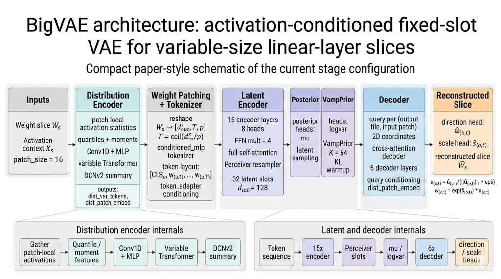
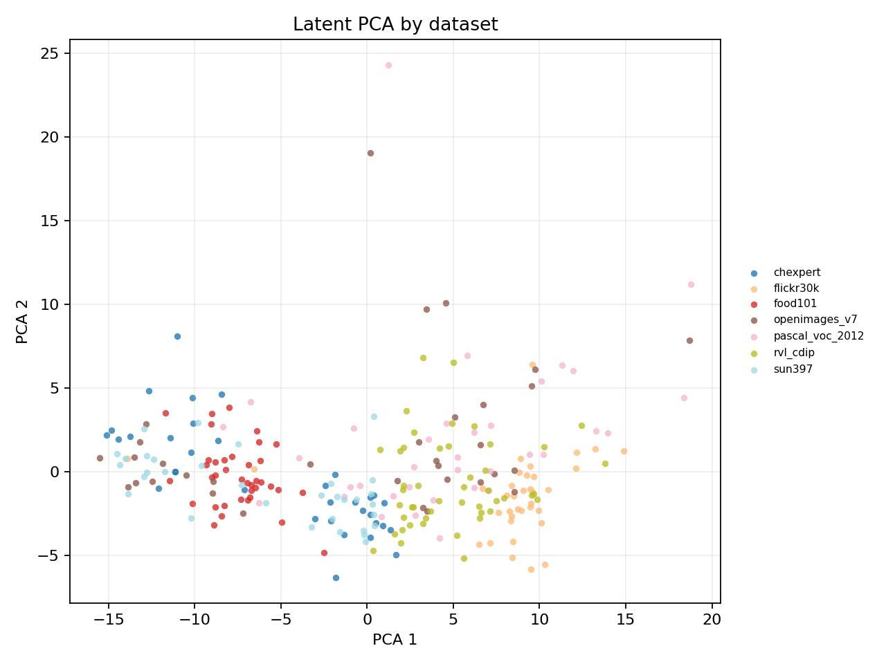
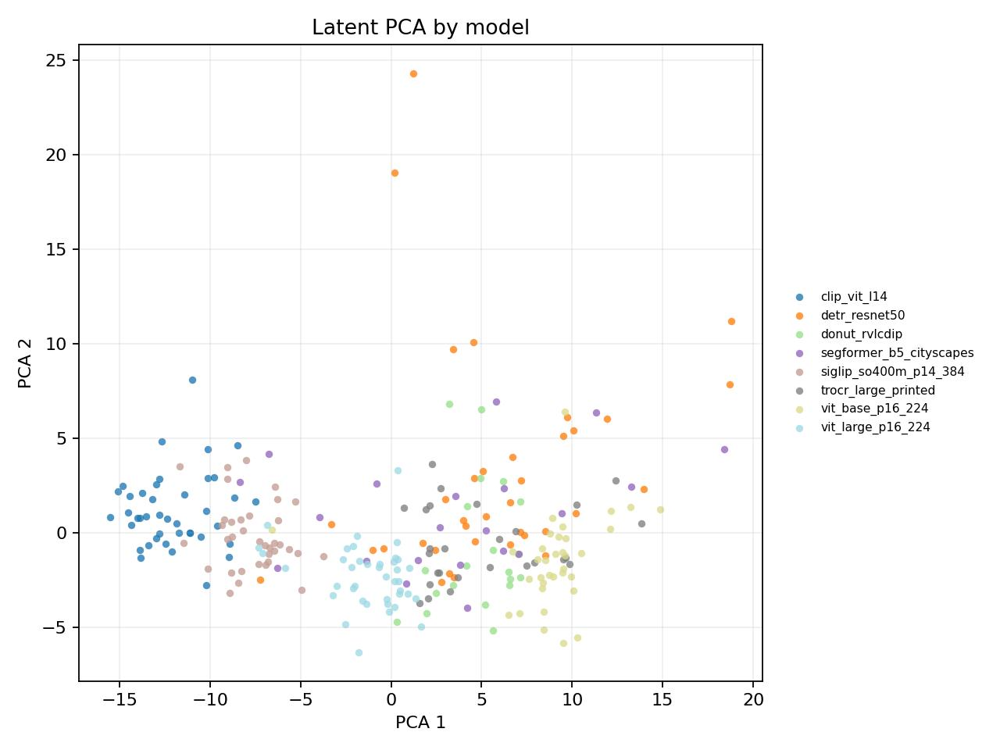
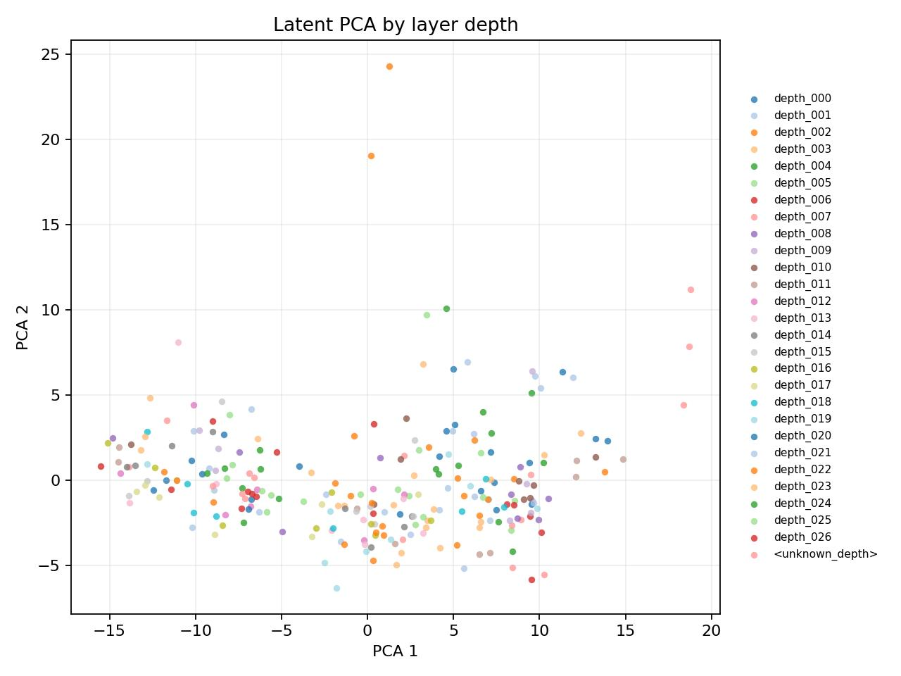
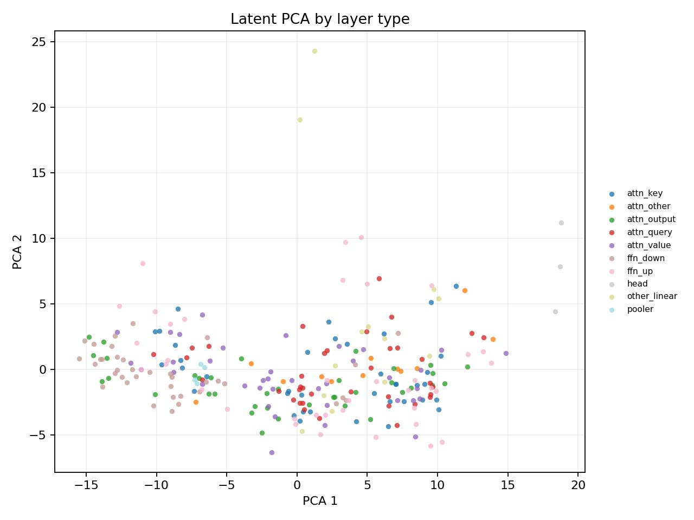
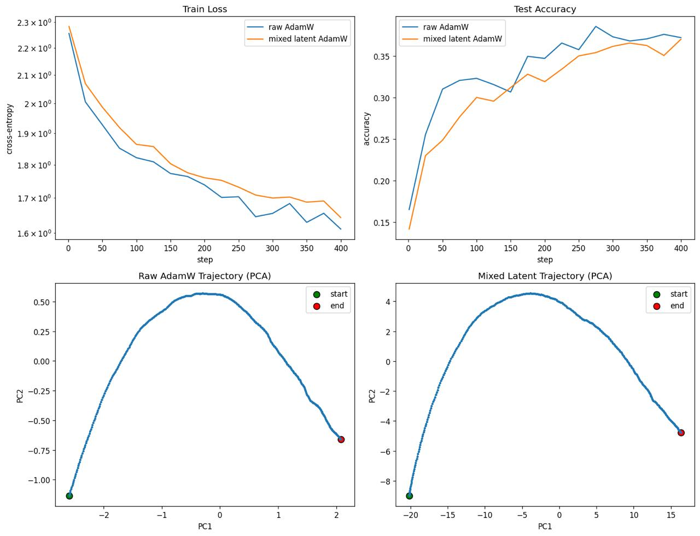

# BigVAE: Fixed-Size Latent Coordinates for Neural Network Weight Manifolds

**Status.** Internal preprint-style report draft.  
**Project.** Activation-conditioned VAE compression of linear-layer weights, followed by latent-space optimization and diffusion-prior initialization.  
**Main artifact.** `BigWeightVAE` / `WeightQuantileVAE` with held-out latent-geometry and CIFAR-10 latent-optimization experiments.  
**Current conclusion.** The representation result is positive but specific: held-out latents show clear organization by source model and source dataset. Projections by layer type and layer depth are useful diagnostics, but they are not currently claimed to form clear separated clusters. The optimizer result is not yet positive: direct latent optimization currently converges slower than raw-weight Adam/AdamW on CIFAR-10.

---

## Abstract

This project studies whether neural network weights should be optimized directly in raw Euclidean parameter space, or through a learned low-dimensional coordinate system. 
The core hypothesis is that trained weights lie in a low dimensional manifold of the full parameter space: not every matrix of the right shape is a useful layer, and the functionally relevant degrees of freedom are fewer than the raw number of entries suggests. BigVAE tests this hypothesis by learning a variational autoencoder over real linear layers extracted from pretrained vision and multimodal models.

The central design choice is fixed-size latent compression. A source linear layer may have shape \(64 \times 64\), \(128 \times 128\), or another compatible size, but each processed slice is compressed into the same number of latent slots. This differs from standard tensor autoencoding and many weight-space generative models, where the latent size effectively scales with the tensor size or the architecture is tied to a fixed model family. This design choice is crucial for future project for training latent diffusion model as optimizer in weight latent space: diffusion works badly with non fixed dimensionality of latent space. But in general fixed latent size is not a constraint, because any linear layer can be splitted into several smaller: e. g. \(128 \times 128\) can be splitted into composition of 4 \(64 \times 64\) linear layers, so we can scale model capacity by scaling split resolution of our weights. So fixed latent space is not a constraint.

BigVAE treats a layer as a conditional operator: it receives a weight slice \(W_s\) and an activation context \(X_s\), encodes the slice into a fixed latent set \(z\), and decodes it back into \(\hat W_s\). The activation context (we try to estimate input distribution) matters because reconstructing a linear map is only useful insofar as the map behaves correctly on the input distribution that actually reaches the layer.

The current evidence is asymmetric. Out-of-domain evaluation shows that the learned latents have visible structure by source model and source dataset. This suggests that each model family and each activation distribution induces its own distribution over useful layer weights, and that the VAE has learned part of this structure rather than only memorizing matrix shapes. Downstream optimization is weaker: on CIFAR-10, latent optimization with a diffusion-prior initialization is currently slower than raw-weight Adam/AdamW. The present status is therefore best described as a successful activation-conditioned weight-representation system whose optimizer use case remains unresolved.

---

## 1. Research motivation

Raw neural weights are a poor coordinate system for optimization. A layer matrix has many degrees of freedom that are not equally meaningful: some perturbations barely change the represented function, some perturbations are functionally equivalent under symmetries. This mismatch is visible in several lines of prior work. Intrinsic-dimension experiments show that many neural objectives can be solved inside much smaller randomly oriented subspaces than the full parameter dimension [1]. Mode-connectivity papers show that independently trained optima can often be connected by low-loss paths [2, 3]. Permutation-aware re-basing work argues that part of the apparent multiplicity of basins disappears after hidden-unit symmetries are aligned [4]. These results do not prove that all useful weights lie on one simple smooth manifold, but they strongly suggest that the raw parameter space contains large irrelevant or redundant regions.

The project turns this geometric observation into a concrete optimizer interface. Instead of updating raw weights \(W\), we learn a decoder

$$
z \mapsto \hat W_\theta(z, C),
$$

where \(z\) is a fixed-size latent representation and \(C\) is context extracted from the layer input distribution. Downstream optimization can then update \(z\), while the frozen decoder maps latent states back to ordinary linear weights. The decoder becomes a learned chart over a subset of weight space: it restricts search to weights that look like real trained layers and behave plausibly on the relevant activation distribution.

The nearest existing areas are hypernetworks, hyper-representations, generative models of checkpoints, and weight-space learning. Hypernetworks generate weights from another network, but they are usually trained end-to-end for a target architecture rather than as a reusable compression map over arbitrary linear-layer slices [5]. Hyper-representations learn embeddings of model zoos and can sample neural weights, but they are often tied to model-zoo structure, layer ordering, or fixed architecture families [6, 7]. Diffusion over neural checkpoints has been used as a learned optimizer/generator, but it operates over checkpoint distributions rather than a reusable activation-conditioned chart for arbitrary linear slices [8]. Weight-space architectures and neural functionals study how to process neural weights while respecting permutation symmetries [9, 10]. BigVAE sits in this broader field, but its practical target is different: we don't want to train VAE for each model family, we try to build foundational model for very broad family of architectures (e. g. VITs for images).

---

## 2. Problem setup

A linear layer is represented as

$$
Y = XW,
$$

where \(X \in \mathbb{R}^{n \times d_{in}}\) is a batch of layer inputs, \(W \in \mathbb{R}^{d_{in} \times d_{out}}\) is the weight matrix, and \(Y \in \mathbb{R}^{n \times d_{out}}\) is the layer output. Here \(n\) is the number of activation samples, \(d_{in}\) is the input width, and \(d_{out}\) is the output width.

The training record is

$$
r = (W, X, m, d, \ell),
$$

where \(m\) is the source model identity, \(d\) is the source dataset, and \(\ell\) is the layer name. Since source layers have different shapes, the pipeline does not train on full matrices as one fixed tensor. It extracts shape-normalized slices

$$
S(r) = (W_s, X_s, M_s),
$$

where \(M_s\) stores masks for padded or invalid entries. The VAE objective is

$$
q_\phi(z \mid W_s, X_s),
$$

$$
p_\theta(W_s \mid z, X_s),
$$

with \(z \in \mathbb{R}^{K \times d_{lat}}\). The important constraint is that \(K\), the number of latent slots, and \(d_{lat}\), the latent width per slot, are fixed by configuration rather than by the raw layer size. In the current BigVAE stage configuration, \(K=32\) and \(d_{lat}=128\), so each processed slice is represented by 4096 scalar latent coordinates.

The effective compression ratio is

$$
\rho = \frac{d_{in}^s d_{out}^s}{K d_{lat}},
$$

where \(d_{in}^s\) and \(d_{out}^s\) are the slice dimensions. The current experimental narrative targets approximately an \(8\times\) compression regime, although the exact ratio depends on the active slicing/tile shape. If a layer is too large for the chosen latent budget, it is decomposed into several slices. This increases the number of local latent blocks while preserving the same interface for each block. Operationally, this is the desired failure mode: a large layer can spend more blocks, but the diffusion/optimizer interface never has to handle arbitrary latent dimensionality inside one local code.

---

## 3. Architecture



**Figure 1.** BigVAE encodes a shape-normalized weight slice and the corresponding activation context into a fixed-size latent representation. The decoder reconstructs weights through direction and scale heads, while the loss checks both matrix structure and layer behavior on \(X_s\).

BigVAE is a conditional VAE over linear-layer weight slices. The system has six functional blocks.

The **distribution encoder** maps the activation context \(X_s\) into patch-level distribution features. The **patch tokenizer** combines local weight vectors with those distribution features. The **latent encoder** maps the conditioned patch sequence into a fixed-size set of latent slots. The **posterior/prior block** turns encoder states into VAE samples and regularizes them against a VampPrior-style latent prior. The **decoder** maps fixed latent slots and activation-context features back into a weight slice. The **external diffusion prior** is trained after the VAE and samples plausible layer latents for downstream optimization.

This decomposition is important. The model is not just a tensor autoencoder with a bottleneck. It is an operator-conditioned autoencoder: the same matrix error has different importance depending on where the input activation distribution puts mass, and the same latent budget must work across variable source layer shapes.

### 3.1 Weight patching

Let \(p\) be the patch size. The input dimension of \(W_s\) is padded and partitioned into

$$
T = \left\lceil \frac{d_{in}^s}{p} \right\rceil
$$

patches. The weight slice is reshaped as

$$
W_s \rightarrow W_{patch} \in \mathbb{R}^{B \times d_{out}^s \times T \times p},
$$

where \(B\) is the batch size. Each output column owns a sequence of input-patch vectors. This representation preserves matrix locality while allowing different source dimensions. The current stage config uses `patch_size = 16`, `stage_base_T_patches = 4`, and `stage_base_d_out = 64` in the training schedule.

### 3.2 Distribution encoder

The distribution encoder receives activation samples \(X_s\). For each input patch it computes distributional statistics rather than a single pooled vector. The current module uses quantiles over samples, normalized quantile features, mean/log-standard-deviation terms, optional covariance features, a variable-token transformer, and a DCNv2-style cross network to produce patch-level distribution embeddings.

This block exists because a layer matrix cannot be judged only as a tensor. Two matrices with similar Euclidean error can have very different functional error on the actual activation support. Conversely, errors in directions never reached by the layer inputs may not matter for the downstream model. Conditioning on \(X_s\) tells the autoencoder where the layer is being used.

### 3.3 Patch tokenizer and encoder conditioning

The current configuration uses a `conditioned_mlp` patch tokenizer. The tokenizer receives the weight patch and distribution features, then produces patch tokens. Distribution features also enter the encoder through token-adapter conditioning. This creates two conditioning routes: the input distribution affects the local encoding of each patch and also modulates the deeper latent encoder layers.

The latent encoder constructs output-local sequences of the form

$$
[\mathrm{CLS}_o, w_{o,1}, \ldots, w_{o,T}],
$$

where \(o\) indexes an output column and \(t\) indexes an input patch. It then applies local token processing and Perceiver-style resampling into a fixed latent set. In the current stage configuration the encoder has 15 layers, model width 128, latent width 128, 32 latent slots, 8 attention heads, no dropout, full self-attention, and `cross_attend_only_cls = false`.

### 3.4 VAE posterior and prior

The system supports deterministic AE operation and VAE operation. The current BigVAE stage uses latent sampling, an encoder mean head, normalized latent slots before posterior heads, and a VampPrior-style learned mixture prior with 64 pseudo-components. The posterior variance is bounded by `latent_sampling_logvar_min = -2`, `latent_sampling_logvar_max = 2`, and `latent_sampling_min_std = 1e-4`.

The trainer uses a KL schedule and a latent-sampling gate. KL starts at zero, warms up for 100000 steps, then ramps over 50000 steps toward the target coefficient. The sampling gate starts at \(10^{-4}\) and ramps to 1.0 over the same interval. This is not cosmetic: a hard transition from deterministic reconstruction to stochastic VAE sampling can destroy reconstruction.

### 3.5 Decoder

The decoder maps latent slots back to a weight slice. It builds coordinate queries for each output-column/input-patch location, conditions those queries with distribution embeddings through an MLP, and cross-attends to the latent slots. Its output head predicts direction and scale:

$$
\hat u_{o,t} = h_{dir}(q_{o,t}),
$$

$$
\hat s_{o,t} = h_{scale}(q_{o,t}).
$$

The reconstructed patch vector is

$$
\hat w_{o,t} = \exp(\hat s_{o,t}) \cdot \frac{\hat u_{o,t}}{\lVert \hat u_{o,t}\rVert_2 + \epsilon}.
$$

This decomposition is used because raw MSE entangles direction and magnitude. The direction component controls which input subspace contributes to an output channel; the scale component controls the norm of that contribution. The decoder also disables the direct \(z\)-shortcut in the current stage, forcing reconstruction through the intended latent pathway.

### 3.6 Active stage configuration

| Parameter | Current value |
|---|---:|
| `patch_size` | 16 |
| `big_vae.d_model` | 128 |
| `big_vae.d_lat` | 128 |
| `big_vae.num_latents` | 32 |
| `big_vae.num_encoder_layers` | 15 |
| `big_vae.num_decoder_layers` | 6 |
| `big_vae.n_heads` | 8 |
| `big_vae.ffn_mult` | 4.0 |
| `big_vae.latent_prior_kind` | `vamp` |
| `big_vae.vamp_prior_K` | 64 |
| `big_vae.patch_tokenizer_kind` | `conditioned_mlp` |
| `big_vae.distribution_encoder_conditioning_kind` | `token_adapter` |
| `big_vae.decoder_query_conditioning_kind` | `mlp` |
| `big_vae.rope_2d_coord_kind` | `normalized_center` |
| `big_vae.disable_z_shortcut` | true |
| `big_vae.disable_distribution_encoder` | false |

---

## 4. Training objective

The training objective combines behavioral reconstruction, structural reconstruction, and KL regularization:

$$
\mathcal{L}_{total} = c_{beh}\mathcal{L}_{beh} + c_{str}\mathcal{L}_{str} + \beta(t)\mathcal{L}_{KL}.
$$

In the active stage config, \(c_{beh}=1\), \(c_{str}=1\), and the target KL coefficient is \(0.001\) after warmup.

The behavioral loss is a weighted sum of three terms:

$$
\mathcal{L}_{beh} = 10\mathcal{L}_{op} + \mathcal{L}^{beh}_{dir} + 10\mathcal{L}^{beh}_{scale}.
$$

The operator term compares the original and reconstructed layer actions:

$$
Y = X_s W_s.
$$

$$
\hat Y = X_s \hat W_s.
$$

$$
\mathcal{L}_{op} = MSE(Y, \hat Y).
$$

The directional behavior term compares normalized output directions, and the scale behavior term compares output magnitudes. The structural loss is

$$
\mathcal{L}_{str} = \mathcal{L}_{dir} + 10\mathcal{L}_{scale}.
$$

Here \(\mathcal{L}_{dir}\) is a cosine-style patch-direction loss, while \(\mathcal{L}_{scale}\) is a Huber penalty on log patch norms. Both behavior and structure losses use a norm-dependent weighting exponent \(\gamma=0.5\), so large-norm patches influence the objective more without completely dominating it. The Huber delta is 0.1.

This loss design is central to the project. A pure structural loss can reconstruct entries while failing to preserve the represented function. A pure behavioral loss can preserve behavior on a narrow activation support while leaving the matrix underconstrained elsewhere. The current objective deliberately combines both signals, following the empirical lesson in behavior-aware weight reconstruction: structural and behavioral losses are complementary, and their combination reconstructs useful neural weights better than either signal alone [11].

---

## 5. Data pipeline

The dataset is built from real pretrained models and real image datasets. Source images are streamed through source models, linear layers are hooked, and each observed layer contributes pairs of weights and activation contexts. The result is an offline dataset of layer slices rather than a dataset of images.

The production path uses raw Hugging Face datasets, model virtualization, `nn.Linear` hooks, shared caching, and a streaming iterable dataset. The stage configuration uses a large offline target size, balanced sampling over dataset/model/layer-type/depth, a maximum activation context of 512 rows, and a slice batch size of 32. This matters because without balancing, the latent space can become dominated by frequent datasets, frequent layer types, or shallow blocks.

### 5.1 Source datasets

| Dataset | Enabled | Gated | HF repository | Streaming | Associated source models |
|---|---:|---:|---|---:|---|
| `bdd100k` | yes | no | `dgural/bdd100k` | yes | `dinov2_base` |
| `cc12m` | yes | no | `flax-community/conceptual-captions-12` | yes | `clip_vit_b32` |
| `coco2017` | yes | no | `phiyodr/coco2017` | yes | `clip_vit_b32`, `siglip_base_p16_384` |
| `flickr30k` | no | no | `nlphuji/flickr30k` | no | `clip_vit_b32`, `dinov2_base` |
| `mapillary_vistas_v2` | yes | yes | `candylion/mapillary-vistas-v2` | yes | `swinv2_base` |
| `relaion400m` | yes | yes | `laion/relaion400m` | yes | `clip_vit_b32` |
| `scene_parse_150` | yes | no | `zhoubolei/scene_parse_150` | yes | `swinv2_base` |
| `visual_genome` | yes | no | `ranjaykrishna/visual_genome` | yes | `clip_vit_b32` |

The default active data profile includes `coco2017`, `cc12m`, `visual_genome`, `scene_parse_150`, `mapillary_vistas_v2`, and `relaion400m`.

### 5.2 Source models

| Model id | Runner | Family | Run mode | HF repository |
|---|---|---|---|---|
| `beit_base` | `hf_vit_runner` | ViT | encoder-only | `microsoft/beit-base-patch16-224` |
| `blip_image_captioning_base` | `hf_encdec_runner` | BLIP | vision encoder only | `Salesforce/blip-image-captioning-base` |
| `clip_vit_b32` | `hf_clip_runner` | CLIP | vision only | `openai/clip-vit-base-patch32` |
| `deit_base` | `hf_vit_runner` | ViT | encoder-only | `facebook/deit-base-patch16-224` |
| `dinov2_base` | `hf_vit_runner` | ViT | encoder-only | `facebook/dinov2-base` |
| `dinov2_vits14` | `hf_vit_runner` | ViT | encoder-only | `facebook/dinov2-small` |
| `donut_base` | `hf_encdec_runner` | Donut | encoder-only | `naver-clova-ix/donut-base` |
| `grounding_dino_tiny` | `hf_dense_runner` | Dense detector | vision only | `IDEA-Research/grounding-dino-tiny` |
| `mask2former_swin_base` | `hf_dense_runner` | Dense segmentation | full | `facebook/mask2former-swin-base-coco-panoptic` |
| `siglip_base_p16_384` | `hf_siglip_runner` | SigLIP | vision only | `google/siglip-base-patch16-384` |
| `swinv2_base` | `hf_vit_runner` | SwinV2 | encoder-only | `microsoft/swinv2-base-patch4-window8-256` |
| `trocr_base_printed` | `hf_encdec_runner` | TrOCR | encoder-only | `microsoft/trocr-base-printed` |
| `vit_mae_base` | `hf_vit_runner` | ViT-MAE | encoder-only | `facebook/vit-mae-base` |

The dataset is therefore not a toy collection of synthetic matrices. It mixes source architectures, source tasks, layer positions, and activation distributions.

---

## 6. Diffusion prior over layer latents

The VAE gives a latent code for a layer slice, but this does not by itself give a good initialization distribution for downstream optimization. Sampling \(z\) from a standard Gaussian is too weak: the decoder receives latent points far from the empirical posterior region and often produces weights that are poor starting points. The project therefore trains a layer-latent diffusion prior.

The diffusion prior operates directly in BigVAE latent space. It conditions on layer metadata and distributional context, uses a transformer/DiT-style denoising network, and supports DDIM sampling. The default prior configuration uses 1000 diffusion training steps, a cosine schedule, 50 sampling steps, DDIM sampling, `prediction_type = v`, and diagonal latent normalization. In the downstream ViT latent-scaling experiments, `init.kind = diffusion_prior` is the default path.

The present interpretation is conservative. The diffusion prior is better aligned with the empirical latent distribution than naive Gaussian sampling, but it has not yet made latent optimization competitive with raw-weight Adam/AdamW. This means that the bottleneck may lie in the VAE compression level, the decoder geometry, the fact that the VAE has only seen final trained solutions, the prior, or the interaction between these components.

---

## 7. Evaluation protocol and current evidence

### 7.1 Out-of-domain latent geometry

The main positive result is the held-out latent dump and visualization. The evaluation pipeline builds an offline dataset from model/dataset pairs not used in the training profile, evaluates a BigVAE checkpoint, stores latent vectors, and produces PCA/t-SNE projections colored by source attributes.

The current report should insert four PCA panels:






| Panel | Coloring | Current interpretation |
|---|---|---|
| PCA by model | Source model id | Clear organization by source model. This supports the view that different pretrained models induce different distributions over useful linear-layer weights. |
| PCA by dataset | Source dataset id | Clear organization by source dataset. This supports the value of activation-conditioned coding: the same kind of layer is not represented independently of its input distribution. |
| PCA by layer type | Parsed layer type | Diagnostic projection only. It may show some structure, but there is no current claim of clear separation. |
| PCA by layer number/depth | Parsed depth label | Diagnostic projection only. It may show weak or partial trends, but there is no current claim of clear separation. |

The qualitative observation is worth reporting, but it must be stated narrowly. The held-out latents show clear structure by source model and source dataset. This suggests that the VAE learns different local distributions of weights for different model families and different activation domains. The layer-type and layer-depth projections are retained as sanity checks, not as headline evidence. The important result is that the latent cloud is not shapeless: model identity and activation domain leave visible signatures in the learned coordinates.

### 7.2 Held-out reconstruction metrics

The held-out evaluation also produces global and grouped metrics:

```text
metrics_summary.json
metrics_global.json
metrics_macro.json
metrics_by_model.csv
metrics_by_dataset.csv
metrics_by_pair.csv
metrics_by_layer.csv
record_metrics.jsonl
coverage.json
latent_dump.pt
```

The report should include the global reconstruction numbers once the exact run is selected. The most important distinction is between matrix reconstruction and operator reconstruction. A visually organized latent space is not enough unless \(\hat W_s\) also preserves \(X_s W_s\) on held-out activation contexts.

**Table slot.** Insert held-out reconstruction metrics here.

| Metric group | Metric | Value | Interpretation |
|---|---|---:|---|
| Global | operator reconstruction | TBD | Functional fidelity on held-out contexts. |
| Global | structural direction | TBD | Patch direction fidelity. |
| Global | structural scale | TBD | Patch norm fidelity. |
| Macro by model | worst model group | TBD | Detects architecture-specific failure. |
| Macro by dataset | worst dataset group | TBD | Detects activation-distribution failure. |

### 7.3 CIFAR-10 latent optimization

The operational endpoint is optimization through frozen BigVAE latents. The ViT latent-scaling pipeline trains a small ViT either by direct raw-weight optimization or by optimizing latent parameters that are decoded into weights. The relevant comparison is not whether latent optimization can reduce loss at all; it is whether it can match or beat Adam/AdamW on raw weights under a comparable budget.

The current CIFAR-10 result is negative. Latent optimization converges slower and performs worse than raw-weight Adam/AdamW. This remains true even when using a diffusion-prior initialization rather than naive Gaussian latent sampling. The right interpretation is not that the manifold idea is dead; it is that the current VAE/prior/parameterization stack is not yet a competitive optimizer substrate.



There are two main interpretations. The mild interpretation is capacity/compression: an approximately \(8\times\) compression regime may be too aggressive for optimization, even if it is good enough to reveal representation structure. The stronger interpretation is distribution shift: the VAE has mostly seen trained solutions, so early and middle optimization checkpoints are out-of-domain for the decoder. A latent optimizer may therefore leave the learned solution-neighborhood chart and decode into poorly conditioned raw-weight updates.

---

## 8. Interpretation

The clean positive result is representational. PCA projections of held-out latents show that the learned space has visible structure by source model and source dataset. This means BigVAE is not merely storing local tensor shape. It learns a distribution over weights that depends on the pretrained model and on the activation domain used to condition reconstruction.

This is already a nontrivial result. Each source model appears to induce its own distribution over linear-layer weights, and each dataset changes the activation contexts under which those weights are reconstructed. The fact that these factors remain visible in held-out latent projections is evidence that fixed-size, activation-conditioned local coding can capture meaningful structure in neural parameters.

The optimizer result is not yet positive. Latent optimization currently performs worse than Adam/AdamW on raw weights. The likely reason is not a single bug-level issue. Raw Adam assumes a Euclidean parameterization of the optimized variables. BigVAE latents are not automatically Euclidean coordinates for the function represented by the decoded weights. The decoder induces its own metric, and a Euclidean step in \(z\)-space may correspond to a highly anisotropic or unstable movement in raw-weight/function space.

This makes the next research question precise. The project has evidence for learned structure in weight latents. It does not yet have evidence that these coordinates are smooth enough, complete enough, or metric-compatible enough for first-order optimization. The path forward is to make the decoder chart less curved and less out-of-domain for optimization trajectories.

---

## 9. Future work

The first likely bottleneck is compression. The current experiments target approximately \(8\times\) compression. This may be too aggressive for optimization even if it is sufficient for reconstruction and clustering. The direct test is to reduce compression by increasing \(K\), increasing \(d_{lat}\), changing tile size, or weakening the KL pressure, then rerun the same CIFAR-10 latent-optimization protocol. If convergence improves sharply when compression is relaxed, the present failure is primarily capacity-limited.

The second bottleneck is decoder geometry. Adam, AdamW, and similar first-order methods are tuned for Euclidean coordinates. A learned decoder defines a pullback metric

$$
G(z) = J_D(z)^\top J_D(z),
$$

where \(D(z)=\hat W_\theta(z,C)\) is the decoder and \(J_D(z)\) is its Jacobian with respect to \(z\). If \(G(z)\) is highly anisotropic or changes rapidly, Euclidean latent updates are not well matched to functional movement of the decoded layer. A natural next direction is Riemannian smoothing: penalize local metric roughness, curvature proxies, or trace/Hutchinson estimates of decoder Jacobian/Hessian variation. The practical target is local Euclideanity: nearby latent points should decode into controlled nearby operators on \(X_s\), so that ordinary optimizers have a useful inductive bias in latent space [12, 13, 14].

The third bottleneck is training-domain mismatch. The VAE has primarily learned to encode/decode trained or near-trained weights. But optimization begins from random or prior-sampled weights and spends many steps in early and middle trajectory regions. Formally, these regions are out-of-domain for a VAE trained only on final solutions. If curvature smoothing and lower compression are insufficient, the likely fix is to train the VAE not only on final trained weights but also on intermediate checkpoints along optimization trajectories. This would teach the chart to cover the states through which latent optimization must actually pass, not only the final solution neighborhood.

---

## 10. References

[1] Chunyuan Li, Heerad Farkhoor, Rosanne Liu, Jason Yosinski. **Measuring the Intrinsic Dimension of Objective Landscapes.** ICLR 2018 / arXiv:1804.08838. https://arxiv.org/abs/1804.08838

[2] Timur Garipov, Pavel Izmailov, Dmitrii Podoprikhin, Dmitry Vetrov, Andrew Gordon Wilson. **Loss Surfaces, Mode Connectivity, and Fast Ensembling of DNNs.** NeurIPS 2018 / arXiv:1802.10026. https://arxiv.org/abs/1802.10026

[3] Felix Draxler, Kambis Veschgini, Manfred Salmhofer, Fred A. Hamprecht. **Essentially No Barriers in Neural Network Energy Landscape.** ICML 2018 / arXiv:1803.00885. https://arxiv.org/abs/1803.00885

[4] Samuel K. Ainsworth, Jonathan Hayase, Siddhartha Srinivasa. **Git Re-Basin: Merging Models modulo Permutation Symmetries.** ICLR 2023 / arXiv:2209.04836. https://arxiv.org/abs/2209.04836

[5] David Ha, Andrew Dai, Quoc V. Le. **HyperNetworks.** ICLR 2017 / arXiv:1609.09106. https://arxiv.org/abs/1609.09106

[6] Konstantin Schürholt, Boris Knyazev, Xavier Giró-i-Nieto, Damian Borth. **Hyper-Representations as Generative Models: Sampling Unseen Neural Network Weights.** NeurIPS 2022 / arXiv:2209.14733. https://arxiv.org/abs/2209.14733

[7] Konstantin Schürholt, Diyar Taskiran, Boris Knyazev, Xavier Giró-i-Nieto, Damian Borth. **Model Zoos: A Dataset of Diverse Populations of Neural Network Models.** NeurIPS 2022 Datasets and Benchmarks / arXiv:2209.14717. https://arxiv.org/abs/2209.14717

[8] William Peebles, Ilija Radosavovic, Tim Brooks, Alexei A. Efros, Jitendra Malik. **Learning to Learn with Generative Models of Neural Network Checkpoints.** arXiv:2209.12892, 2022. https://arxiv.org/abs/2209.12892

[9] Aviv Navon, Aviv Shamsian, Idan Achituve, Ethan Fetaya, Gal Chechik, Haggai Maron. **Equivariant Architectures for Learning in Deep Weight Spaces.** ICML 2023 / arXiv:2301.12780. https://arxiv.org/abs/2301.12780

[10] Allan Zhou, Kaien Yang, Kaylee Burns, Adriano Cardace, Yiding Jiang, Samuel Sokota, J. Zico Kolter, Chelsea Finn. **Permutation Equivariant Neural Functionals.** NeurIPS 2023 / arXiv:2302.14040. https://arxiv.org/abs/2302.14040

[11] Léo Meynent, Ivan Melev, Konstantin Schürholt, Göran Kauermann, Damian Borth. **Structure Is Not Enough: Leveraging Behavior for Neural Network Weight Reconstruction.** ICLR Workshop on Neural Network Weights as a New Data Modality 2025 / arXiv:2503.17138. https://arxiv.org/abs/2503.17138

[12] Clément Chadebec, Stéphanie Allassonnière. **A Geometric Perspective on Variational Autoencoders.** NeurIPS 2022 / arXiv:2209.07370. https://arxiv.org/abs/2209.07370

[13] Yonghyeon Lee, Frank Chongwoo Park. **On Explicit Curvature Regularization in Deep Generative Models.** TAG-ML 2023 / arXiv:2309.10237. https://arxiv.org/abs/2309.10237

[14] Dionysios Kalatzis, David Eklund, Georgios Arvanitidis, Søren Hauberg. **Variational Autoencoders with Riemannian Brownian Motion Priors.** ICML 2020 / arXiv:2002.05227. https://arxiv.org/abs/2002.05227
